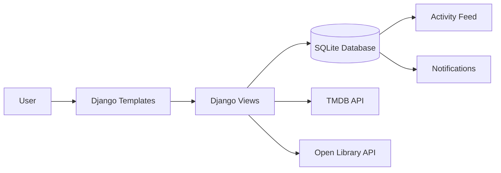

# 📚 Social Library


**Social Library** is a Django-based social media platform for discovering, tracking, reviewing, and sharing movies and books.

It combines ideas from **Goodreads**, **Letterboxd**, and a social activity feed. Users can explore media, build personal libraries, create custom lists, follow others, and interact through likes, comments, and notifications.

---

## 📌 Overview

Social Library allows users to:

- Discover movies and books
- Track watched, read, and planned content
- Rate media from 1 to 10
- Create custom movie/book lists
- Follow other users
- Like and comment on activities
- Receive notifications for social interactions

---

## 🏗️ Tech Stack

| Layer | Technology |
|---|---|
| Backend | Python, Django 5.2 |
| Database | SQLite3 |
| Frontend | Django Templates, HTML, CSS, JavaScript |
| UI Framework | Bootstrap |
| Movie API | TMDB API |
| Book API | Open Library API |
| Main JS File | `static/library/library.js` |

---

## 🧠 System Architecture



---

## ✨ Core Features

### 🔍 Media Exploration

Users can browse movies and books using external APIs.

| Feature | Description |
|---|---|
| Movie discovery | Powered by TMDB API |
| Book discovery | Powered by Open Library API |
| Layout | Responsive multi-column grid |
| Images | Optimized with `object-fit: cover` and hidden overflow |
| Carousel | Removed in favor of a cleaner grid system |

---

### 🧠 Search & Filter System

Users can dynamically filter content by:

| Filter | Description |
|---|---|
| Genre | Filter movies/books by category |
| Release Year | Shows content from the selected year and newer |
| Rating Range | Supports `2–5`, `5–7`, and `7+` |
| Book Rating Handling | Rating input is disabled when book rating data is unavailable |

---

### 🪟 Content Detail Popup

Clicking a movie or book opens a detailed popup with:

- Large cover image
- Summary description
- Year, genre, and metadata
- Duration or page count
- Watch/read status controls
- Rating system from 1 to 10
- Add-to-list option
- Comment popup

---

## 📂 User Library

The personal library page, **Kütüphanem**, uses a tabbed interface.

| Tab | Description |
|---|---|
| Watched | Movies the user has watched |
| To Watch | Movies the user wants to watch |
| Read | Books the user has read |
| To Read | Books the user wants to read |
| Custom Lists | User-created collections |

---

## 📝 Custom Lists

Users can:

- Create lists with an emoji and name
- Add movies and books to lists
- View lists inside content popups
- Keep movies and books organized separately

---

## 📰 Activity Feed

The platform includes an Instagram/Facebook-style activity feed.

| Feature | Description |
|---|---|
| User Avatar | Shows user profile image with fallback |
| Cover Image | Displays movie/book cover |
| Activity Text | Shows activity title and summary |
| Likes | Live like counter |
| Comments | Expandable comment panel |
| Logging | Centralized activity tracking |

---

## 🔔 Notifications

The homepage notification bell supports:

- New followers
- Likes
- Comments

### Fixed Notification Issues

| Problem | Solution |
|---|---|
| Bell displayed on wrong pages | Conditional homepage rendering |
| Duplicate avatar bug | Unified avatar fallback logic |
| Dropdown conflicts | Improved dropdown positioning |

---

## 🧩 Technical Challenge

### Problem

Keeping popup state consistent after user actions such as rating, commenting, or adding content to a list.

### Solution

User interactions are stored in the `Activity` and `ActivityDetail` models. Popup data is preloaded per user when opened, keeping the interface consistent after each action.

---

## 🧱 Project Structure

### Django Apps

| App | Purpose |
|---|---|
| `accounts` | Authentication, profiles, follows, activities, library |
| `explore` | Movie and book discovery |
| `core` | External API clients |

### Key Models

| Model | Purpose |
|---|---|
| `User` | Default Django user model |
| `Profile` | User profile information |
| `Activity` | Main activity feed records |
| `ActivityDetail` | Detailed activity metadata |
| `LibraryItem` | Watched/read/to-watch/to-read items |
| `CustomList` | User-created media lists |
| `Follow` | User follow relationships |
| `Notification` | Social notifications |

---

## 🚀 Getting Started

### 1. Clone the Repository

```bash
git clone https://github.com/Bou-eng/social-library.git
cd social-library
```

---

### 2. Create a Virtual Environment

```bash
python -m venv venv
```

Activate it:

#### Windows

```bash
venv\Scripts\activate
```

#### macOS / Linux

```bash
source venv/bin/activate
```

---

### 3. Install Dependencies

```bash
pip install django
pip install -r requirements.txt
```

If `requirements.txt` is missing, install the basic dependencies manually:

```bash
pip install django requests
```

---

### 4. Run Database Migrations

```bash
python manage.py migrate
```

---

### 5. Create a Superuser

```bash
python manage.py createsuperuser
```

> [!NOTE]  
> This step is optional but recommended for accessing the Django admin panel.

---

### 6. Start the Development Server

```bash
python manage.py runserver
```

Open the project in your browser:

```text
http://127.0.0.1:8000/
```

---

## ⚙️ Development Notes

| Setting | Value |
|---|---|
| Language | Turkish |
| `LANGUAGE_CODE` | `tr` |
| Debug Mode | Enabled |
| Media Directory | `/media/` |
| Local Email Testing | `smtp4dev` |

---

## 🧪 Challenges & Solutions

| Problem | Solution |
|---|---|
| Duplicate avatars | Unified avatar rendering |
| API images not visible | CSS fix with `object-fit: cover` |
| Carousel drag issues | Replaced carousel with responsive grid |
| Broken notification bell | Conditional homepage rendering |
| Popup state inconsistency | Preloaded user-specific popup data |

---

## 🔮 Future Improvements

- Production-grade email service
- Performance optimizations
- ML-based recommendation system
- User-to-user messaging
- Real-time notifications

---

## 📚 References

- [Django Documentation](https://docs.djangoproject.com/)
- [TMDB API Documentation](https://developer.themoviedb.org/docs)
- [Open Library API Documentation](https://openlibrary.org/developers/api)
- [Bootstrap Documentation](https://getbootstrap.com/docs/)

---

## 📄 License

This project was developed for educational purposes.


And here are some screenshots of the project:


